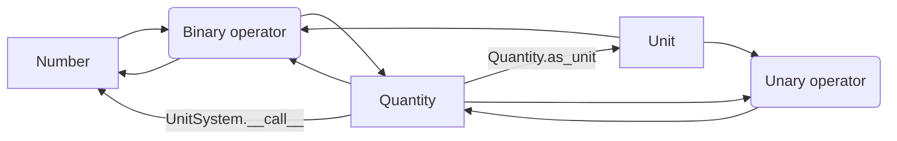

# Quanty Python

A simple Python toolkit for operations with dimensional quantities.
It can be useful for unit conversion and dimensional analysis.

## Usage examples

Let's convert 100 kilometers per hour to meters per second:

```python
from quantypython import Unit, UnitSystem

metre = Unit('m', 'L')
second = Unit('s', 'T')

kilometre = (1000 * metre).as_unit('km')
hour = (3600 * second).as_unit('h')

us = UnitSystem(metre, second)
print(us(100 * kilometre / hour))
```
↳ `27.77777777777778`

Now let's calculate the
[Stefan–Boltzmann constant](https://en.wikipedia.org/wiki/Stefan–Boltzmann_law#Stefan–Boltzmann_constant) and print its
value and dimensionality:

```python
from math import pi
from quantypython import Unit, UnitSystem

second = Unit('s', 'T')
metre = Unit('m', 'L')
kilogram = Unit('kg', 'M')
kelvin = Unit('K', 'THETA')
joule = (kilogram * metre**2 / second**2).as_unit('J')

c = 299_792_458 * metre / second               # The speed of light in a vacuum
k = 1.380_649e-23 * joule / kelvin             # Boltzmann constant
h = 6.626_070_15e-34 * joule * second          # Planck constant
sigma = 2 * pi**5 * k**4 / (15 * c**2 * h**3)  # Stefan–Boltzmann constant

us = UnitSystem(second, kilogram, kelvin)
print(us.str(sigma))
```
↳ `5.67e-08 (kg / s^3 / K^4)`

Now let's express the same result in terms of watt, metre and kelvin:

```python
watt = (joule / second).as_unit('W')
us = UnitSystem(watt, metre, kelvin)
print(us.str(sigma))
```
↳ `5.67e-08 (W / m^2 / K^4)`

Method `UnitSystem.str(self, quantity)` has several parameters allowing you to express quantities in a variety of
different formats.
For example, you can express the units of a quantity in LaTeX:

```python
print(us.str(sigma, value_format=None, power_format='^{{{}}}', mul=' \\times ', div=' \\over ', denominator_format='{}'))
```
↳ `W \over m^{2} \times K^{4}`

You can also easily define your own methods to express quantities using the `UnitSystem.data(self, quantity)` method
which provides all necessary information about a quantity:

```python
value, unit_powers = us.data(sigma)
print(value)
print(unit_powers)
```
↳ `5.670374419184431e-08`

↳ `{<Unit "W": T L^2 M>: Fraction(1, 1), <Unit "m": L>: Fraction(-2, 1), <Unit "K": THETA>: Fraction(-4, 1)}`

## API reference


<div align="center">Transitions between quantities, units and numbers through methods and operators</div>

### `Quantity`

Dimensional quantities are represented as instances of `Quantity`, which store the information about their value and
dimensionality.

While the value of a quantity can not be obtained directly (since it depends on system of units), its dimensionality can
be obtained with the `dims` property which returns a dictionary containing dimension symbols as keys and their powers as
corresponding values.

Method `dim_str(self, **kwargs)` is used to create a string representation of dimensionality.

Class `Quantity` implements all algebraic operations such as addition, multiplication, power and others.
If the result of an operation is dimensionless (e.g. a quantity divided by itself), it will be returned as a
`float`.
In all other cases the result will be a `Quantity`.

Method `as_unit(self, name)` is used to create new units from positive quantities by giving them a name. 

### `Unit`

Units of measurement are represented as instances of `Unit`.
`Unit` is a subclass of `Quantity`, and, essentially, it's a positive quantity with name.
Unlike quantities, units can be used to construct systems of units.

The name of a unit can be obtained by the built-in method `str(unit)`.

### `UnitSystem`

Systems of units are represented as instances of `UnitSystem`.
`UnitSystem` is a set of independent units, which means that none of its units can be expressed in terms of others.

It has 3 methods:
*   `data(self, quantity)` — returns a tuple of two elements: the value of a given quantity and a dictionary containing
    its units as keys and their powers as corresponding values.
*   `__call__(self, quantity)` — returns the value of a given quantity (same as `data(self, quantity)[0]`).
*   `str(self, quantity, **kwargs)` — returns a string representation of a given quantity.
